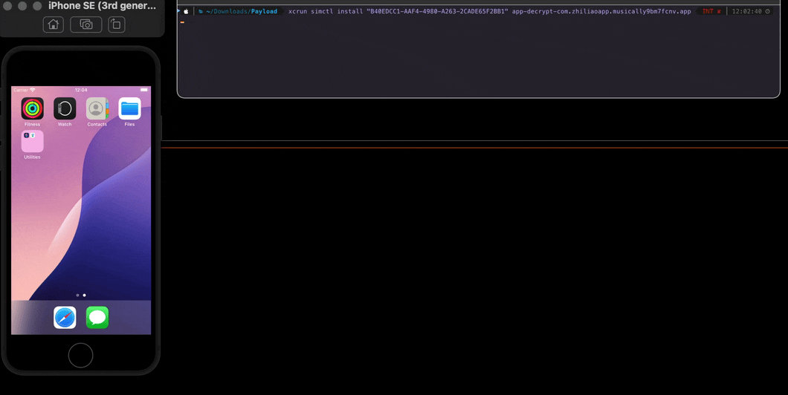

# simforge: Run iOS Apps on Apple Silicon Simulators

simforge is a tool that enables running ARM64 iOS apps on Apple Silicon iOS simulators by modifying the Mach-O binary headers to indicate simulator compatibility.



## Usage

### 1. Prepare the Decrypted App

Start with a decrypted build of the iOS app you want to run in the simulator.

### 2. Extract the IPA

Extract the `.app` bundle from the IPA:

```bash
unzip /path/to/your-app-decrypted.ipa -d /path/to/destination/
```

This will create a `Payload` directory containing the `.app` bundle.

### 3. Convert for Simulator

Run simforge on the extracted `.app` bundle:

```bash
simforge /path/to/Payload/YourApp.app
```

simforge will find all Mach-O binaries in the app bundle and modify their headers (in place) to indicate simulator compatibility

##### Example simforge Output

```bash
simforge ./app-decrypt-com.zhiliaoapp.musically9bm7fcnv.app
Successfully converted: app-decrypt-com.zhiliaoapp.musically9bm7fcnv.app/PlugIns/AWEVideoWidget.appex/AWEVideoWidget
Successfully converted: app-decrypt-com.zhiliaoapp.musically9bm7fcnv.app/PlugIns/AwemeShareExtension.appex/AwemeShareExtension
Successfully converted: app-decrypt-com.zhiliaoapp.musically9bm7fcnv.app/PlugIns/AwemeBroadcastExtension.appex/AwemeBroadcastExtension
Successfully converted: app-decrypt-com.zhiliaoapp.musically9bm7fcnv.app/PlugIns/AwemeNotificationService.appex/AwemeNotificationService
Successfully converted: app-decrypt-com.zhiliaoapp.musically9bm7fcnv.app/PlugIns/TikTokIntentExtension.appex/TikTokIntentExtension
Successfully converted: app-decrypt-com.zhiliaoapp.musically9bm7fcnv.app/PlugIns/TikTokMessageExtension.appex/TikTokMessageExtension
Successfully converted: app-decrypt-com.zhiliaoapp.musically9bm7fcnv.app/PlugIns/AwemeWidgetExtension.appex/AwemeWidgetExtension
Successfully converted: app-decrypt-com.zhiliaoapp.musically9bm7fcnv.app/TikTok
```

### 4. Code Sign the Modified App

After conversion, the app needs to be re-signed. You can simply ad-hoc sign:

```bash
codesign -f -s - --deep /path/to/Payload/YourApp.app
```

### 5. Install to Simulator

You can drag-and-drop `YourApp.app` folder into your simulator home screen to install, or install from command line:

```bash
# List available simulators
xcrun simctl list devices

# Install the app (replace UUID with your simulator's identifier)
xcrun simctl install "SIMULATOR_UUID" /path/to/Payload/YourApp.app
```
